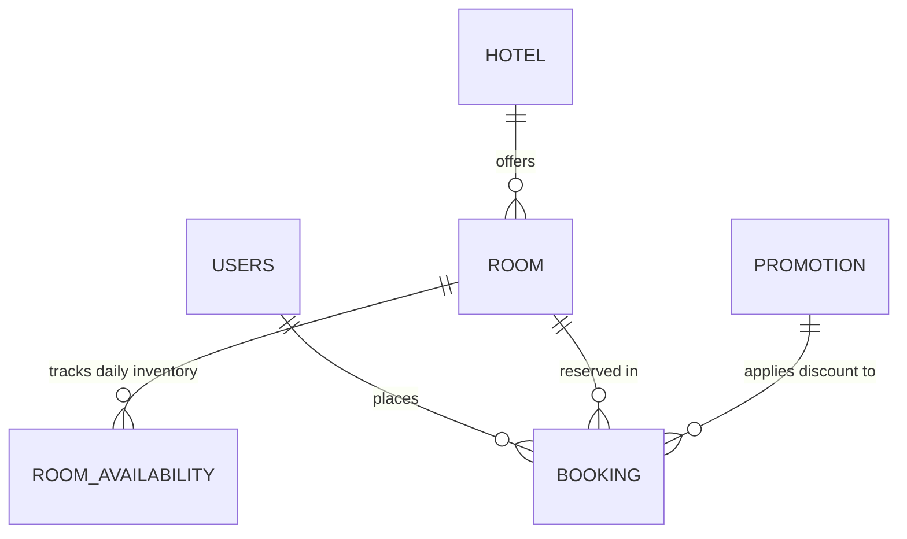

# GrandStay — Hotel Room Booking Platform (Full-Stack MVP)

A full-stack luxury hotel discovery and reservation platform built with **Spring Boot 3**, **PostgreSQL / H2**, **Stateless JWT Security**, and **React (Vite)**.


---

## 1. Features & Capabilities

- **Hotel Discovery & Multi-Facet Search**: Filter hotels by destination city, star rating, price slider, and amenities (WiFi, Pool, Spa, Gym, Restaurant, etc.).
- **Real-Time Live Availability**: Check vacant room units per calendar date range instantaneously.
- **Concurrency-Safe Atomic Bookings**: Pessimistic database locking prevents double-booking race conditions during high-volume checkout.
- **Stateless JWT Authentication**: Secure BCrypt hashed credentials with role-based access control (`CUSTOMER`, `ADMIN`).
- **Discount Promotions Engine**: Apply coupon codes (e.g. `WELCOME10`, `SUMMER25`) with automatic total recalculation.
- **Customer Reservation Center**: Access active and past bookings, copy reservation confirmation numbers (`RES-YYYYMM-XXXXXX`), cancel reservations, or trigger rebooking.
- **Administrative Portal**: Real-time KPI metrics, add/edit hotel properties, manage room inventory categories, and view system-wide bookings.
- **Interactive API Documentation**: Embedded Swagger UI / OpenAPI 3 specification and ready-to-run Postman collection.

---

## 2. Technology Stack

| Layer | Technology |
|---|---|
| **Frontend** | React 18, Vite, React Router 6, Axios, Lucide Icons, Custom Design Tokens |
| **Backend** | Java 17+, Spring Boot 3.3.x, Spring Data JPA, Spring Security, Hibernate |
| **Database** | PostgreSQL 16 (Production/Docker) + H2 In-Memory (Zero-config Dev fallback) |
| **Authentication** | Stateless JWT (JJWT 0.12.x) with Bearer token authentication |
| **API Documentation** | SpringDoc OpenAPI 3 / Swagger UI + Postman Collection |
| **Containerization** | Docker, Docker Compose, Nginx Alpine |
| **CI / CD** | GitHub Actions (`.github/workflows/ci.yml`) |

---

## 3. Quick Start & Local Setup

### Prerequisites
- **Node.js**: v18+ & **npm**
- **Java**: JDK 17+
- **Maven**: 3.8+ (or Docker)

### Option A: Running with Docker Compose (Recommended)

Run the entire full-stack application (PostgreSQL + Spring Boot + React + Nginx) with a single command:

```bash
docker-compose up --build
```

- **Frontend Application**: `http://localhost:3000`
- **Backend REST API**: `http://localhost:8080/api`
- **Swagger / OpenAPI UI**: `http://localhost:8080/swagger-ui.html`

---

### Option B: Running Locally without Docker

#### 1. Start the Backend (Spring Boot)
```bash
cd backend
mvn spring-boot:run
```
*Note: In development mode, the backend starts immediately with an embedded H2 PostgreSQL-compatible database and automatically seeds sample hotels, rooms, users, and promotions.*

#### 2. Start the Frontend (React + Vite)
```bash
cd frontend
npm install
npm run dev
```
Open [http://localhost:3000](http://localhost:3000) in your browser.

---

## 4. Test & Demo Credentials

The system automatically initializes test accounts upon first startup:

| Role | Email | Password | Permissions |
|---|---|---|---|
| **Customer** | `customer@example.com` | `Customer@123` | Browse, Book, View/Cancel Personal Reservations |
| **Admin** | `admin@hotelbooking.com` | `Admin@123` | Full Access: Add/Edit Hotels & Rooms, Manage Bookings |

*Tip: The Login page includes 1-click **Quick Demo Autofill** buttons for instant testing.*

---

## 5. Sample Promotional Discount Codes

| Code | Discount Type | Value | Status |
|---|---|---|---|
| `WELCOME10` | Percentage | 10% Off | Active |
| `SUMMER25` | Percentage | 25% Off | Active |
| `LUXURY50` | Flat Amount | $50.00 Off | Active |

---

## 6. Architecture & Entity Relationship Diagram



For full diagram and constraints, see [`docs/er-diagram.md`](docs/er-diagram.md).

---

## 7. API Documentation & Postman

- **Swagger UI**: [http://localhost:8080/swagger-ui.html](http://localhost:8080/swagger-ui.html)
- **OpenAPI JSON**: [http://localhost:8080/v3/api-docs](http://localhost:8080/v3/api-docs)
- **Postman Collection**: Located in [`docs/hotel-booking-api.postman_collection.json`](docs/hotel-booking-api.postman_collection.json) (includes automated pre-request authentication scripts).
- **API Contract Specification**: Detailed endpoints catalog in [`docs/api-contract.md`](docs/api-contract.md).

---

## 8. Running Automated Tests

### Backend Tests
```bash
cd backend
mvn test
```

### Frontend Build Validation
```bash
cd frontend
npm run build
```

---

## 9. Deliverables Directory Map

```
Hostel Booking/
├── backend/                  # Spring Boot 3 REST API & JPA Layer
│   ├── src/main/java/com/hotelbooking/
│   │   ├── config/           # Security, CORS, Swagger, Seed Data
│   │   ├── controller/       # REST Controllers
│   │   ├── dto/              # Request / Response Schemas
│   │   ├── entity/           # JPA Entities (User, Hotel, Room, Booking, etc.)
│   │   ├── exception/        # Centralized @ControllerAdvice
│   │   ├── repository/       # Spring Data JPA Repositories
│   │   ├── security/         # JWT Provider, Auth Filter, UserDetails
│   │   └── service/          # Concurrency-safe business logic
│   ├── pom.xml
│   └── Dockerfile
├── frontend/                 # React 18 + Vite Application
│   ├── src/
│   │   ├── components/       # Navbar, Footer, HotelCard, RoomCard, BookingModal, SearchBar
│   │   ├── context/          # AuthContext & NotificationContext
│   │   ├── pages/            # Home, HotelList, HotelDetail, MyBookings, AdminDashboard, Login, Register
│   │   ├── services/         # Axios API client with JWT interceptors
│   │   └── index.css         # Modern glassmorphic design system
│   ├── package.json
│   ├── vite.config.js
│   └── Dockerfile
├── docs/
│   ├── er-diagram.md
│   ├── api-contract.md
│   ├── screens-and-workflows.md
│   └── hotel-booking-api.postman_collection.json
├── .github/workflows/ci.yml  # GitHub Actions CI Workflow
├── docker-compose.yml        # Multi-container orchestration
└── README.md
```
