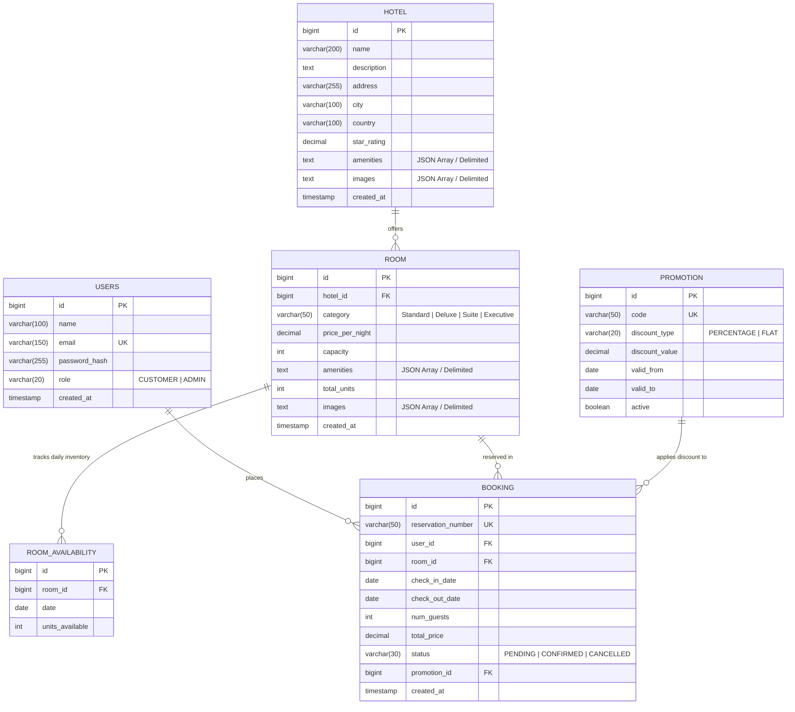

# Database Entity Relationship (ER) Diagram

## Entity Constraints & Invariants

1. **User Table**:
   - `email` is indexed and unique.
   - `password_hash` stores BCrypt hashes (never raw plaintext).
   - `role` defaults to `CUSTOMER`.

2. **Hotel Table**:
   - `city` is indexed for fast location-based search.
   - `star_rating` ranges between `1.0` and `5.0`.

3. **Room & Availability**:
   - `hotel_id` foreign key references `HOTEL(id)` with cascade deletion protection.
   - `total_units` defines baseline physical capacity.
   - `ROOM_AVAILABILITY` maintains available units per date. If missing, units available defaults to `room.total_units`.
   - Date range bookings decrement availability atomically.

4. **Booking**:
   - `reservation_number` is auto-generated with unique alphanumeric format (e.g., `RES-202609-AB12C3`).
   - `status` transitions: `PENDING` -> `CONFIRMED` -> `CANCELLED`.
   - Cancellation restores available units to the respective dates.
