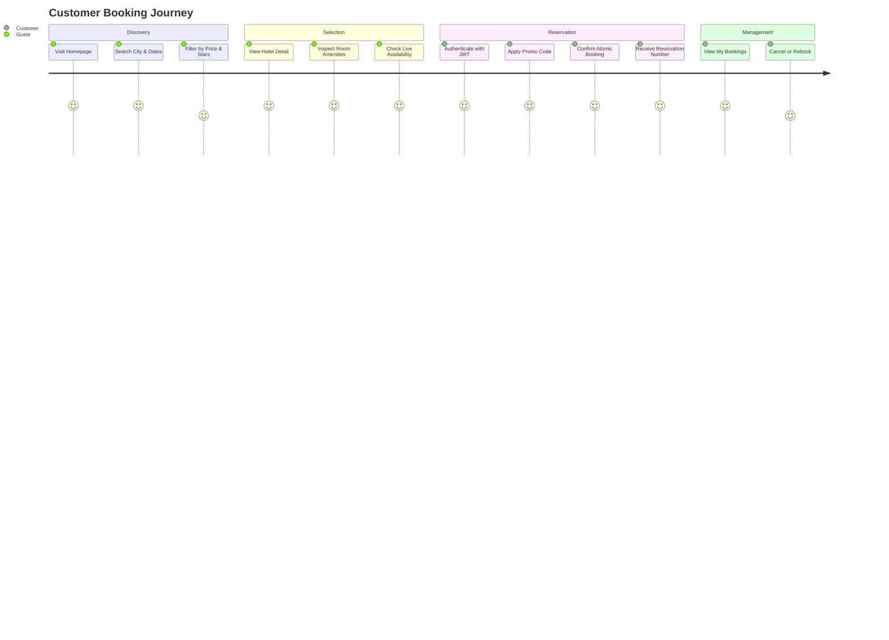

# Screens and Workflows Documentation

## Key User Roles & Journeys

---

## Screen Catalog

### 1. Home / Search Hub (`/`)
- **Hero Banner:** Dynamic search bar with City/Destination input, Date Picker (Check-In / Check-Out), Guest Counter, and Search CTA button.
- **Curated Destinations:** Cards highlighting popular cities (New York, Miami, Paris, Tokyo, London).
- **Featured Luxury Hotels:** Carousel/grid of top-rated hotels with price per night, rating badges, and instant "View Rooms" triggers.
- **Why Choose Us:** Value proposition badges (Instant Confirmation, Concurrency-Safe Booking, Best Rate Guarantee, 24/7 Concierge).

### 2. Hotel Search & Catalog (`/hotels`)
- **Left Sidebar Filter Panel:**
  - Search location searchbox.
  - Price Range dual-slider ($50 – $1000+).
  - Star Rating filter (3★, 4★, 5★).
  - Amenities checkboxes (WiFi, Pool, Spa, Gym, Restaurant, Parking, Ocean View).
  - Sorting dropdown (Price: Low to High, Price: High to Low, Highest Rated).
- **Results List & Grid:** Hotel cards displaying photo gallery, badges, location pin, star rating, starting price, and "Check Availability" buttons.

### 3. Hotel Details & Room Selector (`/hotels/:id`)
- **Hotel Showcase:** High-resolution image banner, description, address, amenities chips.
- **Interactive Availability Bar:** Date selector to compute nightly rates and live room availability in real-time.
- **Room Category Cards:**
  - Category (Standard, Deluxe, Suite, Executive).
  - Capacity (e.g., Up to 3 guests).
  - Room amenities list.
  - Live availability counter (e.g., "Only 2 rooms left!").
  - "Book Now" CTA button triggering the interactive booking modal.

### 4. Booking Checkout Modal / Page
- **Booking Summary:** Hotel name, room category, chosen date range, number of nights calculated.
- **Pricing Breakdown:** Room cost per night x nights, taxes/fees, promo code input with instant discount calculation.
- **Guest Information:** Prefilled user name and email.
- **Confirmation Step:** Direct atomic reservation submission, generating the unique reservation code (e.g., `RES-202609-9X8K21`).

### 5. Customer Dashboard ("My Bookings") (`/my-bookings`)
- **Tab Navigation:** "Upcoming Bookings", "Past Bookings", "Cancelled".
- **Booking Card Elements:**
  - Reservation Number with copy-to-clipboard button.
  - Hotel photo, address, check-in & check-out dates.
  - Total price paid & discount applied.
  - Status badge (`CONFIRMED` in emerald green, `CANCELLED` in crimson, `PENDING` in amber).
  - **Cancel Booking Button** (with confirmation dialog & immediate inventory restoration).
  - **Rebook Shortcut Button** (pre-fills dates and hotel/room in search/modal).

### 6. Admin Inventory & Booking Dashboard (`/admin`)
- **KPI Metrics:** Total Bookings, Active Inventory, Total Revenue, Active Promotions.
- **Hotel & Room Inventory Management:**
  - "Add Hotel" modal with form validation (name, city, address, rating, amenities, image URLs).
  - "Add Room" modal (category, capacity, base units, price per night).
  - Edit/Delete actions.
- **System-Wide Bookings Table:** Searchable list of all customer reservations with status filters and cancellation overrides.

### 7. Authentication (`/login` & `/register`)
- Sleek glassmorphic card with form validation.
- **Quick Demo Credentials Autofill buttons**:
  - `Customer Demo (customer@example.com / Customer@123)`
  - `Admin Demo (admin@hotelbooking.com / Admin@123)`
